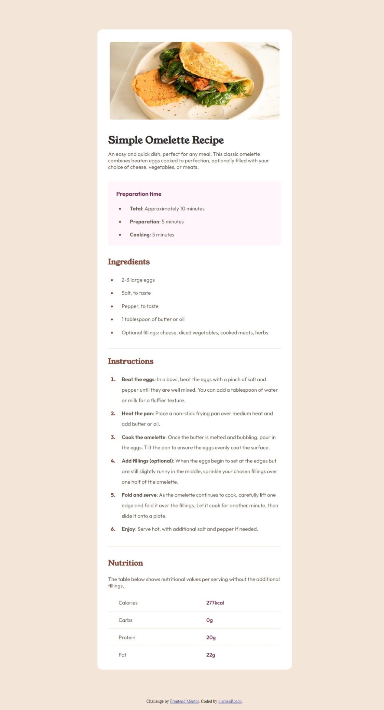
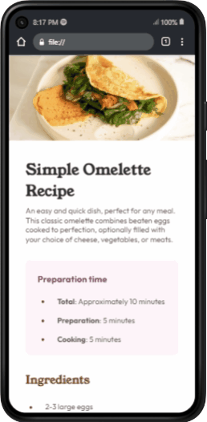

# Frontend Mentor - Recipe page solution

This is a solution to the [Recipe page challenge on Frontend Mentor](https://www.frontendmentor.io/challenges/recipe-page-KiTsR8QQKm). Frontend Mentor challenges help you improve your coding skills by building realistic projects. 

## Table of contents

- [Overview](#overview)
  - [Desktop Screenshot](#desktop-long-screenshot)
  - [Mobile Screenshot](#mobile-screenshot)
  - [The challenge](#the-challenge)
  - [Features](#features)
  - [File Structure](#file-structure)
  - [TO View](#to-view)
  - [credit](#credits)

- [My process](#my-process)
  - [Built with](#built-with)
  - [What I learned](#what-i-learned)
  - [Continued development](#continued-development)
  - [Useful resources](#useful-resources)
- [Author](#author)
- [Acknowledgments](#acknowledgments)

## Overview

This project is a simple HTML page presenting a recipe for making a classic omelette. It includes instructions, ingredients, preparation time, and nutritional information.

### **Desktop Long Screenshot**



### **Mobile Design Gif**

<center></center>

### Links

- Solution URL: [Add solution URL here](https://your-solution-url.com)
- Live Site URL: [Add live site URL here](https://your-live-site-url.com)

## The challenge

## Features

- **Responsive Design**: The page layout adjusts to different screen sizes using CSS media queries.
- **Custom Fonts**: Utilizes custom fonts for headings and text elements.
- **Styled Components**: The page is styled using inline CSS within the `<style>` tags.
- **Image**: Includes an image of the prepared omelette for visual appeal.
- **Semantic HTML**: Uses semantic HTML elements for better accessibility and SEO.

## File Structure

- **index.html**: Contains the HTML structure of the webpage.
- **style.css**: Includes CSS styles for the page layout and design.
- **assets**: Folder containing images and fonts used in the project.
  - **images**: Contains the image of the omelette used in the project.
  - **fonts**: Includes custom fonts used for the page.

## To View

To view the recipe page, simply open the `index.html` file in a web browser.

## Credits

- **Challenge**: This project is based on a challenge from [Frontend Mentor](https://www.frontendmentor.io?ref=challenge).

## **Author**: Created by [clemenRoach](https://github.com/clemenRoach).

## My process

### Built with

- Semantic HTML5 markup
- CSS custom properties
- Flexbox
- Mobile-first workflow
- Media Query 

### What I learned

**Table in HTML**
```html
<table>
       <table>
          <tr>
            <td>Calories</td>
            <td>277kcal</td>
          </tr>
          <tr>
            <td>Carbs</td>
            <td>0g</td>
          </tr>
          <tr>
            <td>Protein</td>
            <td>20g</td>
          </tr>
          <tr>
            <td>Fat</td>
            <td>22g</td>
          </tr>
        </table>
```

**`::marker`, `nth-child` and  `last-child`** 

```css
li::marker{
  color: var(--Nutmeg);
  font-weight: 800;
}
.nutrition-sec table td:nth-child(2){
  color: var(--DarkRaspberry);
  font-weight: 600;
}

.nutrition-sec table tr:last-child{
  border-bottom: 0px solid var(--LightGrey);
}
```

### Useful resources

- [Example resource 1](https://www.example.com) - This helped me for XYZ reason. I really liked this pattern and will use it going forward.
- [Example resource 2](https://www.example.com) - This is an amazing article which helped me finally understand XYZ. I'd recommend it to anyone still learning this concept.

## Author

- Github - [clemenRoach](https://www.github.com/clemenRoach)
- Frontend Mentor - [@clemenRoach](https://www.frontendmentor.io/profile/clemenRoach)


## Acknowledgments

use semantic tags and learn pseudo classes, pseudo elements.
